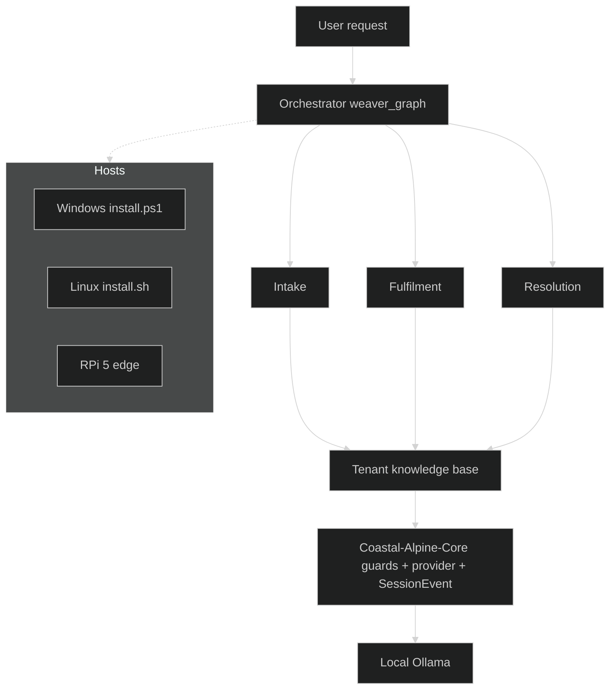

# Weaver Agents: Technical Architecture

This document details the system design, relational schemas, and agent routing state machines for the multi-tenant, edge-deployed helpdesk engine.

---

## System Overview

Weaver is designed to provide secure, offline multi-tenant document retrieval and query routing. The entire engine runs locally at the edge (Taranaki HQ/remote job-sites) on Raspberry Pi or local server clusters, communicating with a local Ollama SLM.

**Hybrid stack:** Weaver depends on **Coastal-Alpine-Core** (SecurityGuard, Telemetry, SovereignOllamaClient, SessionEvent, provider registry, flywheel hooks), pairs with **Aether** for sovereign development / HITL / computer use, and ships inside **coastal-alpine-stack**.

**Dual-platform hosts:** develop on **Windows 10/11** or **Linux**; deploy production workloads on **RPi 5 16GB + Hailo-10H** (or Linux edge servers). Installers: `install.sh`, `install.ps1`, `bootstrap.py`.

**Core pin:** `coastal-alpine-core @ v0.5.8` — https://github.com/fivepanelhat/Coastal-Alpine-Core/releases/tag/v0.5.8



```text
┌─────────────────────────────────────────────────────┐
│                   User Request                      │
└───────────────────────┬─────────────────────────────┘
                        │
                        ▼
               ┌─────────────────┐
               │  Orchestrator   │
               │  (weaver_graph) │
               └────────┬────────┘
                        │
         ┌──────────────┼──────────────┐
         ▼              ▼              ▼
  ┌────────────┐ ┌────────────┐ ┌────────────┐
  │ Intake     │ │ Fulfilment │ │ Resolution │
  │ Agent      │ │ Agent      │ │ Agent      │
  └──────┬─────┘ └──────┬─────┘ └──────┬─────┘
         │              │              │
         └──────────────┼──────────────┘
                        ▼
         ┌──────────────────────────────┐
         │     Tenant Knowledge Base    │
         │   (Isolated Vector Store)    │
         └──────────────────────────────┘
```

---

## Sprint A — Core seams (2026-08-21)

| Phase | Capability | Core | Weaver adoption |
|-------|------------|------|-----------------|
| 1 | SessionEvent append-only audit stream | [v0.5.7](https://github.com/fivepanelhat/Coastal-Alpine-Core/releases/tag/v0.5.7) · [PR #27](https://github.com/fivepanelhat/Coastal-Alpine-Core/pull/27) | [PR #37](https://github.com/fivepanelhat/Weaver/pull/37) — emit on orchestrator path |
| 2 | LLM provider Protocol + edge profiles | [v0.5.8](https://github.com/fivepanelhat/Coastal-Alpine-Core/releases/tag/v0.5.8) · [PR #28](https://github.com/fivepanelhat/Coastal-Alpine-Core/pull/28) | [PR #38](https://github.com/fivepanelhat/Weaver/pull/38) — `get_provider(profile=…)` |

**LLM resolution order** (`weaver_graph/llm.py`):
1. `coastal_alpine_core.get_provider(profile=…)` (Core ≥0.5.8)
2. `SovereignOllamaClient` (legacy)
3. stdlib Ollama HTTP `/api/generate`
4. deterministic offline fallback

**CAT constraints:** local-first JSONL / Ollama, no secrets in event payloads or profiles, HITL evidence path only (events do not control guardrails).

Companion: Aether soft bridges — [PR #51](https://github.com/fivepanelhat/Aether/pull/51) (SessionEvent), [PR #52](https://github.com/fivepanelhat/Aether/pull/52) (provider profile).

---

## 1. Relational Database Schema (SQLAlchemy)

Multi-tenancy is enforced at both the relational and semantic layers.

### Entities (`models.py`):
- `tenants` — Primary business accounts, including subscription states and identifiers.
- `tenant_configs` — Scoped configuration keys (e.g. brand voice, routing rules, contact lists).
- `knowledge_sources` — Catalog of files and documents uploaded by the tenant.
- `interaction_logs` — Audit log of all interactions, metadata, and agent outcomes.
- `vector_embeddings` — (For pgvector/Milvus) Vector representations scoped by `tenant_id` and document mapping.

### Tenant Isolation Enforcement (`database.py` & `knowledge_base.py`):
Every database session initialization is scoped. All queries must pass a matching tenant ID, which is validated by `coastal_alpine_core.security.tenant_isolated_query` to block tenant cross-contamination.

---

## 2. Agent Orchestration State Machine (LangGraph)

Routing logic is compiled into a lightweight state machine under `weaver_graph/graph.py`:

```text
┌──────────────┐
│  Intake      ├──────► (Checks tenant token and query context)
└──────┬───────┘
       │
       ▼
┌──────────────┐
│  Fulfillment ├──────► (Retrieves scoped vector facts, runs Gemma 4)
└──────┬───────┘
       │
       ▼
┌──────────────┐
│  Resolution  ├──────► (Assembles response & validates logs)
└──────────────┘
```

### Routing Nodes (`weaver_graph/orchestrator.py`):
1. **Intake Agent:** Resolves request context, verifies tenant subscriptions, and sanitizes input prompts via `coastal_alpine_core.security.input_guard_check`.
2. **Fulfillment Agent:** Performs local RAG (Retrieval Augmented Generation) by loading matching database facts, constructing prompts with tenant-specific voice parameters, and generating completions.
3. **Resolution Agent:** Verifies output compliance and writes audit trail logs.
