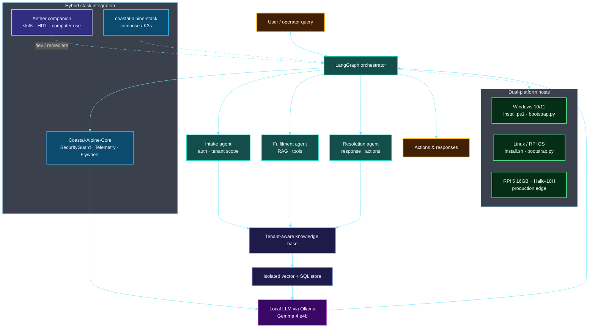

# Weaver: AI-Native Multi-Tenant Agentic Mesh

<p align="center">
  
</p>

**Coastal Alpine Tech Limited**  
*Edge AI | Sovereign Systems | Practical Intelligence*

**License: Proprietary — Coastal Alpine Tech Limited** · See [LICENSE](./LICENSE) (same Coastal Alpine proprietary terms as AquaGuard, SoilGuard, Blue-Moon, Sting-Operation, Core, and the rest of the edge stack).

White-label multi-tenant AI helpdesk scaffold with isolated knowledge retrieval and local LangGraph orchestration.

---

## The 5 Ws: Project Context

- **Who:** Built by Coastal Alpine Tech Limited, designed for high-stakes Kiwi industries (civil construction, agritech, etc.).
- **What:** A decentralized LangGraph orchestration layer that safely directs multi-agent tasks and handles local document vectorization.
- **Where:** Engineered at HQ in New Plymouth, Taranaki. Deployable strictly at the edge.
- **When:** Active development as of June 2026.
- **Why:** To guarantee data sovereignty by keeping tenant operational data local and strictly partitioned.

---

## The Problem We Are Solving

The problem we are solving is ensuring secure, tenant-isolated AI operations in multi-client environments without reliance on external cloud services that risk data leakage or compliance violations.

Additional challenges addressed:
1. **Data Leakage & Compliance** — Sending sensitive industrial data to external LLM providers is unacceptable.
2. **Tenant Cross-Contamination** — Risk of mixing client data in shared systems.
3. **Rigid Routing** — Inability of static helpdesks to adapt intelligently to varied requests.

---

## Key Features

- Tenant-aware multi-agent orchestration (Intake, Fulfilment, Resolution)
- Strict data isolation via SQLAlchemy and tenant-partitioned vector stores
- Local LangGraph-based state machine for adaptive routing
- Modular knowledge base with RAG support
- White-label ready for industry-specific deployments
- Full offline edge capability

---

## Quick Start

### Prerequisites

- Python 3.10+
- Ollama with a local LLM Gemma 4 E4B
- PostgreSQL (optional) or in-memory mode

### Installation & Setup

Weaver is **Windows + Linux** (and macOS) ready. Edge production target remains **RPi 5 16GB + Hailo-10H**. Hybridised with **Coastal-Alpine-Core**, **Aether** (companion skills / HITL), and **coastal-alpine-stack**.

* **Prerequisites**: [setup.md](setup.md)
* **Full install guide**: [installation.md](installation.md)

### One-line install (recommended)

<details open>
<summary><strong>🐧 Linux / macOS</strong></summary>

```bash
curl -fsSL https://raw.githubusercontent.com/fivepanelhat/Weaver/main/install.sh | bash
```

</details>

<details>
<summary><strong>🪟 Windows (PowerShell)</strong></summary>

```powershell
irm https://raw.githubusercontent.com/fivepanelhat/Weaver/main/install.ps1 | iex
```

> **Note:** If script execution is blocked: `Set-ExecutionPolicy -Scope CurrentUser RemoteSigned`

</details>

### Cross-platform bootstrap (from a clone)

```bash
git clone https://github.com/fivepanelhat/Weaver.git
cd Weaver
python bootstrap.py          # Linux / macOS / Windows — creates venv, installs Core + deps
```

### Manual Installation

<details open>
<summary><strong>🐧 Linux / macOS (Bash)</strong></summary>

```bash
git clone https://github.com/fivepanelhat/Weaver.git
cd Weaver

python3 -m venv venv
source venv/bin/activate

pip install -U pip
pip install "git+https://github.com/fivepanelhat/Coastal-Alpine-Core.git@v0.5.5"
pip install -r requirements.txt
pip install -r requirements-dev.txt
cp .env.example .env
```

**System packages (Debian/Ubuntu/RPi OS):**

```bash
sudo apt-get update
sudo apt-get install -y python3-dev python3-venv python3-pip git build-essential
```

</details>

<details>
<summary><strong>🪟 Windows (PowerShell)</strong></summary>

```powershell
git clone https://github.com/fivepanelhat/Weaver.git
cd Weaver

python -m venv venv
.\venv\Scripts\Activate.ps1

python -m pip install -U pip
pip install "git+https://github.com/fivepanelhat/Coastal-Alpine-Core.git@v0.5.5"
pip install -r requirements.txt
pip install -r requirements-dev.txt
Copy-Item .env.example .env
```

**Prerequisites:** [Python 3.10+](https://www.python.org/downloads/) with “Add Python to PATH”, [Git for Windows](https://git-scm.com/).

</details>

### Model Setup & Validation

Ensure Ollama is running locally and pull the target model:
```bash
ollama pull gemma4:e4b
python demo.py
```

To run smoke tests validating state graph transitions:
```bash
pytest
```

---

## Architecture Overview

Weaver routes multi-tenant requests entirely on the edge node: **RPi 5 16GB + Hailo-10H**, local Ollama, and tenant-isolated stores. No tenant data leaves the deployment site.


### System map


```mermaid
%%{init: {
  "theme": "dark",
  "themeVariables": {
    "fontSize": "15px",
    "fontFamily": "Inter, ui-sans-serif, system-ui, sans-serif",
    "primaryColor": "#0ea5e9",
    "primaryTextColor": "#f8fafc",
    "primaryBorderColor": "#38bdf8",
    "lineColor": "#67e8f9",
    "secondaryColor": "#1e293b",
    "tertiaryColor": "#0f172a",
    "clusterBkg": "#0b1220cc",
    "clusterBorder": "#38bdf880",
    "titleColor": "#e2e8f0"
  },
  "flowchart": {
    "nodeSpacing": 36,
    "rankSpacing": 44,
    "padding": 18,
    "htmlLabels": true,
    "curve": "basis",
    "useMaxWidth": true
  }
}}%%
flowchart TB

    classDef act fill:#422006,stroke:#fbbf24,stroke-width:2px,color:#fffbeb
    classDef core fill:#134e4a,stroke:#2dd4bf,stroke-width:2px,color:#f0fdfa
    classDef store fill:#1e1b4b,stroke:#a5b4fc,stroke-width:2px,color:#eef2ff
    classDef ai fill:#3b0764,stroke:#e879f9,stroke-width:2px,color:#fdf4ff
    classDef sdk fill:#0c4a6e,stroke:#38bdf8,stroke-width:2px,color:#f0f9ff
    classDef host fill:#052e16,stroke:#4ade80,stroke-width:2px,color:#f0fdf4
    classDef companion fill:#312e81,stroke:#c4b5fd,stroke-width:2px,color:#eef2ff

    U["User / operator query"] --> ORCH["LangGraph orchestrator"]
    ORCH --> IN["Intake agent<br/>auth · tenant scope"]
    ORCH --> FU["Fulfilment agent<br/>RAG · tools"]
    ORCH --> RE["Resolution agent<br/>response · actions"]
    IN & FU & RE --> KB["Tenant-aware knowledge base"]
    KB --> STORE["Isolated vector + SQL store"]
    STORE --> LLM["Local LLM via Ollama<br/>Gemma 4 e4b"]
    LLM --> ORCH
    ORCH --> OUT["Actions & responses"]

    subgraph HYBRID["Hybrid stack integration"]
        CAC["Coastal-Alpine-Core<br/>SecurityGuard · Telemetry · Flywheel"]
        AETH["Aether companion<br/>skills · HITL · computer use"]
        CAS["coastal-alpine-stack<br/>compose / K3s"]
    end

    subgraph HOSTS["Dual-platform hosts"]
        WIN["Windows 10/11<br/>install.ps1 · bootstrap.py"]
        LIN["Linux / RPi OS<br/>install.sh · bootstrap.py"]
        RPI["RPi 5 16GB + Hailo-10H<br/>production edge"]
    end

    ORCH --> CAC
    CAC --> LLM
    AETH -.->|dev / remediate| ORCH
    CAS -.-> ORCH
    ORCH -.-> HOSTS

    class U,OUT act
    class ORCH,IN,FU,RE core
    class KB,STORE store
    class LLM ai
    class CAC,CAS sdk
    class AETH companion
    class WIN,LIN,RPI host
```

| Layer | Components | Role |
| :--- | :--- | :--- |
| **Orchestrator** | LangGraph state machine | Deterministic multi-agent routing |
| **Agents** | Intake · Fulfilment · Resolution | Tenant-scoped task handling |
| **Knowledge** | Isolated vector + SQL | No cross-tenant leakage |
| **Inference** | Ollama on-device | Offline-capable responses |
| **SDK hybrid** | Coastal-Alpine-Core | Guards, telemetry, flywheel on every path |
| **Companion** | Aether | Dev orchestration, HITL, computer use |
| **Hosts** | Windows · Linux · RPi 5 | Same code; dual installers + bootstrap.py |

*Full detail: [ARCHITECTURE.md](./ARCHITECTURE.md)*

## Directory Structure

```bash
Weaver/
├── agent_knowledge_base/      # Policy, ethics, and platform runbooks (Markdown)
├── weaver_graph/              # Edge-friendly state graph (does not shadow PyPI langgraph)
│   ├── graph.py               # StateGraph compiler
│   ├── llm.py                 # Local Ollama client bridge (LocalSovereignLLM)
│   ├── orchestrator.py        # build_agnostic_helpdesk graph nodes
│   ├── embeddings.py          # Embedding helpers
│   └── ingestion.py           # Document ingestion
├── orchestrator.py            # AgentOrchestrator — unified entrypoint (agent + graph paths)
├── agents.py                  # Intake / Fulfilment / Resolution agents
├── knowledge_base.py          # Tenant-isolated KB clients (in-memory + SQLAlchemy)
├── database.py                # TenantAwareDB connection utilities
├── models.py                  # SQLAlchemy relational & vector schemas
├── demo.py                    # Local simulation runner (offline-capable)
├── bootstrap.py               # Cross-platform venv + dependency bootstrap
├── tests/                     # pytest suite (orchestrator, LLM URL, demo smoke)
├── tests_security_stress/     # Adversarial / red-team suite (prompt attacks)
├── .env.example
├── requirements.txt
├── requirements-dev.txt
├── Dockerfile
├── ARCHITECTURE.md            # System design details
└── README.md                  # This file
```

---

## Technology Stack

**Hardware**  
- **Raspberry Pi 5 (16GB)** with **Hailo-10H NPU** (40 TOPS AI Accelerator / AI HAT+ 2)

**Software**  
- Orchestration: LangGraph  
- Inference: Ollama + Local LLMs  
- Data: SQLAlchemy + pgvector / local vector stores  
- Deployment: Docker-ready, systemd compatible

---

## Target Deployment Scenarios

> These are the use cases Weaver is **designed for**. Weaver is at an early
> release (v0.1.0) and these are illustrative target scenarios, not claims of
> existing production deployments.

- **Civil Construction Helpdesk**: Route project-compliance queries across multiple subcontractors on-premise, keeping each client's data strictly isolated.
- **Agritech Support Platform**: Provide localized advisory services to cooperatives without exposing farm data to third-party clouds.
- **White-Label Service Providers**: Embed into existing SaaS platforms whose clients require sovereign, on-site data handling.

**Implementation Notes:**
- Install on a dedicated edge server or Raspberry Pi cluster.
- Configure tenant IDs at database and vector store level for isolation.
- Use systemd services for persistent operation and monitor via local dashboards.
- Start with `demo.py` to validate routing and isolation before production scaling.

---

## Performance Targets

> Preliminary, illustrative figures measured informally on the reference edge
> node (RPi 5 16GB + Hailo-10H, Gemma 4 E4B via Ollama). Not audited
> production benchmarks — treat as ballpark expectations and re-measure for
> your own workload and hardware.

* **Routing latency:** on the order of ~1 second per routing decision.
* **Active power draw:** roughly ~6W on a headless Raspberry Pi 5 16GB node.
* **Storage footprint:** SQL + vector stores well under 200MB for small tenants.

---

## Documentation

- [ARCHITECTURE.md](./ARCHITECTURE.md)
- [agent_knowledge_base/platform_runbook.md](./agent_knowledge_base/platform_runbook.md)
- [agent_knowledge_base/ethics_review_playbook.md](./agent_knowledge_base/ethics_review_playbook.md)
- [CHANGELOG.md](./CHANGELOG.md)

---

## License

This project is licensed under the **Coastal Alpine Tech Limited License** (proprietary / commercial) — the same license used across the Kiwi Edge AI Stack (Weaver, AquaGuard, SoilGuard, Blue-Moon, Sting-Operation, Coastal-Alpine-Core, coastal-alpine-stack, Sovereign-Edge-Firmware, fivepanelhat).

- Full terms: [LICENSE](./LICENSE)
- No open-source grant is implied by access to this repository
- Commercial use requires a written agreement with Coastal Alpine Tech Limited

---

**Built with focus on data sovereignty and edge intelligence.**  
Questions or collaboration? Contact Coastal Alpine Tech Limited.

---

*Last updated: July 2026 · First public release: v0.1.0*

---

## Project badges

Status badges for this repository (CI, security, license, and stack metadata):

[](LICENSE)  
[](https://www.python.org/)  
[]()  
[]()  
[]()  
[]()  
[]()  
[](https://github.com/fivepanelhat/Weaver/actions/workflows/ci-scan.yml)  
[](https://github.com/fivepanelhat/Weaver/actions/workflows/secops.yml)  
[](https://github.com/fivepanelhat/Weaver/actions/workflows/redteam.yml)  
[]()  
[]()
