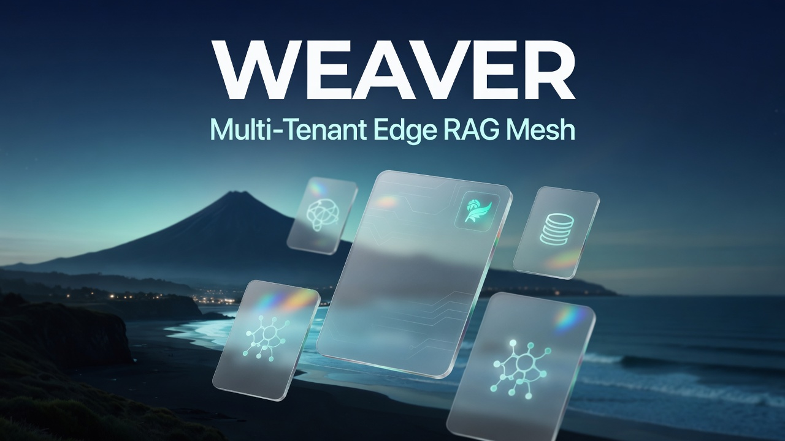
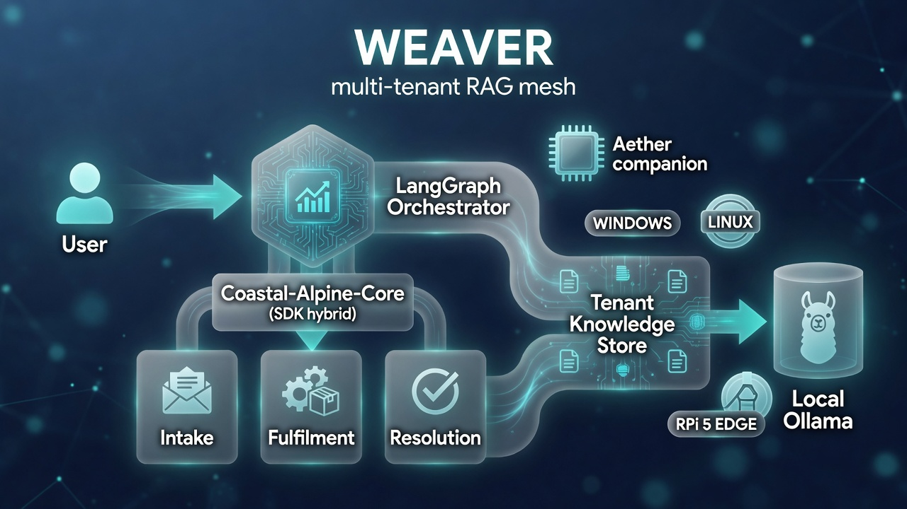

# Weaver: AI-Native Multi-Tenant Agentic Mesh

[](./COMPLIANCE.md)
[](./SECURITY.md)
[](./COMPLIANCE.md)


<!-- BEGIN CAT_CONGRUENCE_SNIPPET -->
## Coastal Alpine Tech portfolio

[](https://github.com/fivepanelhat/fivepanelhat)
[](https://github.com/fivepanelhat/fivepanelhat)
[](./.github/agent-fleet/AGENTS.md)
[](https://github.com/fivepanelhat/fivepanelhat)

**Part of the [Kiwi Edge AI Stack](https://github.com/fivepanelhat/fivepanelhat)** | Founder OS: [NZ-Start-Up](https://github.com/fivepanelhat/NZ-Start-Up) | Agent policy: [`.github/agent-fleet/`](./.github/agent-fleet/)

> Sovereign hybrid edge AI for NZ farms and founders - local-first + multi-model, Te Mana Raraunga aligned - collaborating with Venture Taranaki, startups.com investors and Kotahitanga Investment Fund (HITL + cultural advisory for formal approaches).

**Agents inform, draft, prepare, monitor, and remind. Humans advise, sign, file, send, and pay.** 
Anti-hallucination policy: [`.github/agent-fleet/anti-hallucination.md`](./.github/agent-fleet/anti-hallucination.md) | Congruence: [`CAT_CONGRUENCE.md`](./CAT_CONGRUENCE.md)
<!-- END CAT_CONGRUENCE_SNIPPET -->

<!-- BEGIN PRIVACY_SECURITY_GOVERNANCE -->
## Privacy · Security · Governance

Coastal Alpine Tech products treat operational and personal data as **taonga**. Defaults favour **local-first** operation, **purpose-limited** collection, and **Human-in-the-Loop** for high-stakes actions.

| Pillar | Commitment |
| :--- | :--- |
| **Privacy** | Local-first / offline-capable where practical; Privacy Act 2020 awareness; cloud and third-party AI only when **opt-in and labelled** |
| **Security** | No silent exfiltration of tenant or personal data; owner-controlled keys; SecOps / dependency hygiene on the fleet cadence |
| **Governance** | Agents **inform, draft, prepare**; humans **advise, sign, file, send, and pay**. Te Mana Raraunga spirit for Māori data sovereignty |

**Agents inform, draft, prepare, monitor, and remind. Humans advise, sign, file, send, and pay.**

Fleet policy: [fivepanelhat / Kiwi Edge AI Stack](https://github.com/fivepanelhat/fivepanelhat) · Product detail: [`COMPLIANCE.md`](./COMPLIANCE.md) · [`SECURITY.md`](./SECURITY.md) (where present) · [`CAT_CONGRUENCE.md`](./CAT_CONGRUENCE.md) (where present)
<!-- END PRIVACY_SECURITY_GOVERNANCE -->


<!-- BEGIN PROBLEMS_SOLUTIONS_ECONOMY -->
## Problems we are solving

**Weaver** is the multi-tenant edge orchestration and local RAG mesh for high-stakes Kiwi operations helpdesks.

1. **Data leakage risk** - Sending industrial / farm / client docs to public LLM APIs is unacceptable for many NZ operators.
2. **Tenant cross-contamination** - Shared SaaS helpdesks mix client knowledge unless isolation is designed in.
3. **Rigid routing** - Static ticket trees cannot adapt to multi-step operational requests.
4. **Cloud dependency** - Rural enterprises need local RAG and agent graphs that survive offline windows.

## Solution we have built

| Built capability | What it does |
| :--- | :--- |
| **Tenant-aware agents** | Intake / fulfilment / resolution with isolation |
| **Local LangGraph orchestration** | Adaptive routing on-edge |
| **Partitioned vector knowledge** | Per-tenant retrieval without cross-bleed |
| **White-label posture** | Industry-specific deployments on the Kiwi Edge stack |

Pairs with **Aether** (companion skills) and **Core** (edge primitives) under the portfolio map.

### Local (Taranaki) and national (Aotearoa) economic benefits

| Lever | Benefit |
| :--- | :--- |
| **Regional R&D HQ** | Product design and IP stay in New Plymouth / Taranaki - not only Auckland/offshore SaaS |
| **Primary-sector productivity** | On-farm and rural tools aim to cut waste, protect consents, and support export competitiveness |
| **Skilled employment pathways** | Edge install, field support, agritech ops, software, compliance, and cultural advisory roles as pilots scale |
| **Data sovereignty** | Te Mana Raraunga-aligned local custody keeps high-value operational data onshore |
| **HITL jobs quality** | Agents **inform / draft / prepare / monitor / remind**; humans **advise / sign / file / send / pay** - augment people, do not fake full autonomy |

**Stage honesty (pre-seed):** Impact today is founder R&D, near-term contractors, and EDA/partner leverage. Permanent multi-region payroll follows paid pilots and revenue - we do not invent headcount claims.
<!-- END PROBLEMS_SOLUTIONS_ECONOMY -->

[](./LICENSE)
[](https://www.python.org)
[](./CHANGELOG.md)

[](https://github.com/fivepanelhat/Weaver)
[](https://github.com/fivepanelhat/Weaver)
[](https://github.com/fivepanelhat/Weaver)
[](https://github.com/fivepanelhat/Weaver)

[](https://anthropic.com)
[](https://gemini.google.com)
[](https://openai.com)
[](https://x.ai)

[](https://github.com/fivepanelhat/Weaver)
[](./ARCHITECTURE.md)
[](./Dockerfile)

[](https://github.com/fivepanelhat/Weaver/actions/workflows/ci-scan.yml)
[](https://github.com/fivepanelhat/Weaver/actions/workflows/secops.yml)
[](https://github.com/fivepanelhat/Weaver/security/dependabot)

<p align="center">
 
</p>

**Coastal Alpine Tech Limited** pre-seed startup, New Plymouth, Taranaki, Aotearoa New Zealand.
*Edge AI | Sovereign Systems | Practical Intelligence*

**License: Proprietary Coastal Alpine Tech Limited** | See [LICENSE](./LICENSE) (same Coastal Alpine proprietary terms as AquaGuard, SoilGuard, Blue-Moon, Sting-Operation, Core, and the rest of the edge stack).

White-label multi-tenant AI helpdesk scaffold with isolated knowledge retrieval and local LangGraph orchestration.

---

## The 5 Ws: Project Context

- **Who:** Built by Coastal Alpine Tech Limited (pre-seed), designed for high-stakes Kiwi industries (civil construction, agritech, etc.).
- **What:** A decentralized LangGraph orchestration layer that safely directs multi-agent tasks and handles local document vectorization.
- **Where:** Engineered at HQ in New Plymouth, Taranaki. Deployable strictly at the edge.
- **When:** Active development as of June 2026.
- **Why:** To support data sovereignty by keeping tenant operational data local and strictly partitioned.

---


---

## Key Features

- Tenant-aware multi-agent orchestration (Intake, Fulfilment, Resolution)
- Strict data isolation via SQLAlchemy and tenant-partitioned vector stores
- Local LangGraph-based state machine for adaptive routing
- Modular knowledge base with RAG support
- White-label ready for industry-specific deployments
- Full offline edge capability

---

## Quick Start

### Prerequisites

- Python 3.10+
- Ollama with a local LLM Gemma 4 E4B
- PostgreSQL (optional) or in-memory mode

### Installation & Setup

Weaver is **Windows + Linux** (and macOS) ready. Edge production target remains **RPi 5 16GB + Hailo-10H**. Hybridised with **Coastal-Alpine-Core**, **Aether** (companion skills / HITL), and **coastal-alpine-stack**.

* **Prerequisites**: [setup.md](setup.md)
* **Full install guide**: [installation.md](installation.md)

### One-line install (recommended)

<details open>
<summary><strong> Linux / macOS</strong></summary>

```bash
curl -fsSL https://raw.githubusercontent.com/fivepanelhat/Weaver/main/install.sh | bash
```

</details>

<details>
<summary><strong> Windows (PowerShell)</strong></summary>

```powershell
irm https://raw.githubusercontent.com/fivepanelhat/Weaver/main/install.ps1 | iex
```

> **Note:** If script execution is blocked: `Set-ExecutionPolicy -Scope CurrentUser RemoteSigned`

</details>

### Cross-platform bootstrap (from a clone)

```bash
git clone https://github.com/fivepanelhat/Weaver.git
cd Weaver
python bootstrap.py # Linux / macOS / Windows creates venv, installs Core + deps
```

### Manual Installation

<details open>
<summary><strong> Linux / macOS (Bash)</strong></summary>

```bash
git clone https://github.com/fivepanelhat/Weaver.git
cd Weaver

python3 -m venv venv
source venv/bin/activate

pip install -U pip
pip install "git+https://github.com/fivepanelhat/Coastal-Alpine-Core.git@v0.5.5"
pip install -r requirements.txt
pip install -r requirements-dev.txt
cp .env.example .env
```

**System packages (Debian/Ubuntu/RPi OS):**

```bash
sudo apt-get update
sudo apt-get install -y python3-dev python3-venv python3-pip git build-essential
```

</details>

<details>
<summary><strong> Windows (PowerShell)</strong></summary>

```powershell
git clone https://github.com/fivepanelhat/Weaver.git
cd Weaver

python -m venv venv
.\venv\Scripts\Activate.ps1

python -m pip install -U pip
pip install "git+https://github.com/fivepanelhat/Coastal-Alpine-Core.git@v0.5.5"
pip install -r requirements.txt
pip install -r requirements-dev.txt
Copy-Item .env.example .env
```

**Prerequisites:** [Python 3.10+](https://www.python.org/downloads/) with "Add Python to PATH", [Git for Windows](https://git-scm.com/).

</details>

### Model Setup & Validation

Ensure Ollama is running locally and pull the target model:
```bash
ollama pull gemma4:e4b
python demo.py
```

To run smoke tests validating state graph transitions:
```bash
pytest
```

---

## Architecture Overview

> **Diagrams:** Architecture images and Mermaid maps describe the **target product architecture** for this pre-seed stack. They are engineering design maps not claims of large-scale commercial fleet deployment.

Weaver routes multi-tenant requests entirely on the edge node: **RPi 5 16GB + Hailo-10H**, local Ollama, and tenant-isolated stores. No tenant data leaves the deployment site.



### System map


```mermaid
%%{init: {
 "theme": "dark",
 "themeVariables": {
 "fontSize": "15px",
 "fontFamily": "Inter, ui-sans-serif, system-ui, sans-serif",
 "primaryColor": "#0ea5e9",
 "primaryTextColor": "#f8fafc",
 "primaryBorderColor": "#38bdf8",
 "lineColor": "#67e8f9",
 "secondaryColor": "#1e293b",
 "tertiaryColor": "#0f172a",
 "clusterBkg": "#0b1220cc",
 "clusterBorder": "#38bdf880",
 "titleColor": "#e2e8f0"
 },
 "flowchart": {
 "nodeSpacing": 36,
 "rankSpacing": 44,
 "padding": 18,
 "htmlLabels": true,
 "curve": "basis",
 "useMaxWidth": true
 }
}}%%
flowchart TB

 classDef act fill:#422006,stroke:#fbbf24,stroke-width:2px,color:#fffbeb
 classDef core fill:#134e4a,stroke:#2dd4bf,stroke-width:2px,color:#f0fdfa
 classDef store fill:#1e1b4b,stroke:#a5b4fc,stroke-width:2px,color:#eef2ff
 classDef ai fill:#3b0764,stroke:#e879f9,stroke-width:2px,color:#fdf4ff
 classDef sdk fill:#0c4a6e,stroke:#38bdf8,stroke-width:2px,color:#f0f9ff
 classDef host fill:#052e16,stroke:#4ade80,stroke-width:2px,color:#f0fdf4
 classDef companion fill:#312e81,stroke:#c4b5fd,stroke-width:2px,color:#eef2ff

 U["User / operator query"] --> ORCH["LangGraph orchestrator"]
 ORCH --> IN["Intake agent<br/>auth | tenant scope"]
 ORCH --> FU["Fulfilment agent<br/>RAG | tools"]
 ORCH --> RE["Resolution agent<br/>response | actions"]
 IN & FU & RE --> KB["Tenant-aware knowledge base"]
 KB --> STORE["Isolated vector + SQL store"]
 STORE --> LLM["Local LLM via Ollama<br/>Gemma 4 e4b"]
 LLM --> ORCH
 ORCH --> OUT["Actions & responses"]

 subgraph HYBRID["Hybrid stack integration"]
 CAC["Coastal-Alpine-Core<br/>SecurityGuard | Telemetry | Flywheel"]
 AETH["Aether companion<br/>skills | HITL | computer use"]
 CAS["coastal-alpine-stack<br/>compose / K3s"]
 end

 subgraph HOSTS["Dual-platform hosts"]
 WIN["Windows 10/11<br/>install.ps1 | bootstrap.py"]
 LIN["Linux / RPi OS<br/>install.sh | bootstrap.py"]
 RPI["RPi 5 16GB + Hailo-10H<br/>production edge"]
 end

 ORCH --> CAC
 CAC --> LLM
 AETH -.-> | dev / remediate | ORCH
 CAS -.-> ORCH
 ORCH -.-> HOSTS

 class U,OUT act
 class ORCH,IN,FU,RE core
 class KB,STORE store
 class LLM ai
 class CAC,CAS sdk
 class AETH companion
 class WIN,LIN,RPI host
```

 | Layer | Components | Role |
 | :--- | :--- | :--- |
 | **Orchestrator** | LangGraph state machine | Deterministic multi-agent routing |
 | **Agents** | Intake | Fulfilment | Resolution | Tenant-scoped task handling |
 | **Knowledge** | Isolated vector + SQL | No cross-tenant leakage |
 | **Inference** | Ollama on-device | Offline-capable responses |
 | **SDK hybrid** | Coastal-Alpine-Core | Guards, telemetry, flywheel on every path |
 | **Companion** | Aether | Dev orchestration, HITL, computer use |
 | **Hosts** | Windows | Linux | RPi 5 | Same code; dual installers + bootstrap.py |

*Full detail: [ARCHITECTURE.md](./ARCHITECTURE.md)*

## Directory Structure

```bash
Weaver/
|-- agent_knowledge_base/ # Policy, ethics, and platform runbooks (Markdown)
|-- weaver_graph/ # Edge-friendly state graph (does not shadow PyPI langgraph)
| |-- graph.py # StateGraph compiler
| |-- llm.py # Local Ollama client bridge (LocalSovereignLLM)
| |-- orchestrator.py # build_agnostic_helpdesk graph nodes
| |-- embeddings.py # Embedding helpers
| -- ingestion.py # Document ingestion
|-- orchestrator.py # AgentOrchestrator unified entrypoint (agent + graph paths)
|-- agents.py # Intake / Fulfilment / Resolution agents
|-- knowledge_base.py # Tenant-isolated KB clients (in-memory + SQLAlchemy)
|-- database.py # TenantAwareDB connection utilities
|-- models.py # SQLAlchemy relational & vector schemas
|-- demo.py # Local simulation runner (offline-capable)
|-- bootstrap.py # Cross-platform venv + dependency bootstrap
|-- tests/ # pytest suite (orchestrator, LLM URL, demo smoke)
|-- tests_security_stress/ # Adversarial / red-team suite (prompt attacks)
|-- .env.example
|-- requirements.txt
|-- requirements-dev.txt
|-- Dockerfile
|-- ARCHITECTURE.md # System design details
-- README.md # This file
```

---

## Technology Stack

**Hardware**
- **Raspberry Pi 5 (16GB)** with **Hailo-10H NPU** (40 TOPS AI Accelerator / AI HAT+ 2)

**Software**
- Orchestration: LangGraph
- Inference: Ollama + Local LLMs
- Data: SQLAlchemy + pgvector / local vector stores
- Deployment: Docker-ready, systemd compatible

---

## Target Deployment Scenarios

> These are the use cases Weaver is **designed for**. Weaver is at an early
> release (v0.1.0) and these are illustrative target scenarios, not claims of
> existing production deployments.

- **Civil Construction Helpdesk**: Route project-compliance queries across multiple subcontractors on-premise, keeping each client's data strictly isolated.
- **Agritech Support Platform**: Provide localized advisory services to cooperatives without exposing farm data to third-party clouds.
- **White-Label Service Providers**: Embed into existing SaaS platforms whose clients require sovereign, on-site data handling.

**Implementation Notes:**
- Install on a dedicated edge server or Raspberry Pi cluster.
- Configure tenant IDs at database and vector store level for isolation.
- Use systemd services for persistent operation and monitor via local dashboards.
- Start with `demo.py` to validate routing and isolation before production scaling.

---

## Performance Targets

> Preliminary, illustrative figures measured informally on the reference edge
> node (RPi 5 16GB + Hailo-10H, Gemma 4 E4B via Ollama). Not audited
> production benchmarks treat as ballpark expectations and re-measure for
> your own workload and hardware.

* **Routing latency:** on the order of ~1 second per routing decision.
* **Active power draw:** roughly ~6W on a headless Raspberry Pi 5 16GB node.
* **Storage footprint:** SQL + vector stores well under 200MB for small tenants.

---

## Documentation

- [ARCHITECTURE.md](./ARCHITECTURE.md)
- [agent_knowledge_base/platform_runbook.md](./agent_knowledge_base/platform_runbook.md)
- [agent_knowledge_base/ethics_review_playbook.md](./agent_knowledge_base/ethics_review_playbook.md)
- [CHANGELOG.md](./CHANGELOG.md)

---

## License

This project is licensed under the **Coastal Alpine Tech Limited License** (proprietary / commercial) the same license used across the Kiwi Edge AI Stack (Weaver, AquaGuard, SoilGuard, Blue-Moon, Sting-Operation, Coastal-Alpine-Core, coastal-alpine-stack, Sovereign-Edge-Firmware, fivepanelhat).

- Full terms: [LICENSE](./LICENSE)
- No open-source grant is implied by access to this repository
- Commercial use requires a written agreement with Coastal Alpine Tech Limited

---

**Built with focus on data sovereignty and edge intelligence.**
Questions or collaboration? Contact Coastal Alpine Tech Limited.

---

*Last updated: July 2026 | First public release: v0.1.0*
